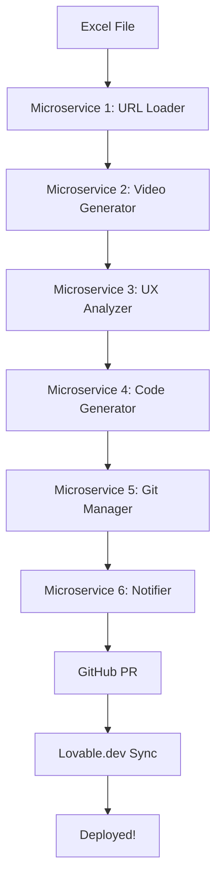

# 🚀 Kick Inn UX Automation System

<div align="center">


**Automated end-to-end UI/UX improvement pipeline from video recording to GitHub deployment**

[Features](#-features) • [Quick Start](#-quick-start) • [Architecture](#-architecture) • [Documentation](#-documentation) • [Contributing](#-contributing)

</div>

---

## 📖 Overview

Kick Inn UX Automation is a **microservices-based system** that automates the entire UI/UX improvement workflow:

1. 📹 **Records** user journey videos with Playwright
2. 🔍 **Analyzes** UI/UX using Claude Vision API
3. ⚡ **Generates** improved code automatically
4. 🚀 **Deploys** via GitHub PR + Lovable.dev sync

**Built for:** Product teams, UX designers, and developers who want to iterate faster on UI improvements.

---

## ✨ Features

- 🎯 **Fully Automated** - From video to deployment with zero manual intervention
- 🧩 **Modular Architecture** - 6 independent microservices
- ⚡ **Parallel Processing** - Handles 45+ pages simultaneously
- 🔄 **GitHub Integration** - Automatic PR creation and sync
- 🤖 **AI-Powered** - Claude Vision for UX analysis, Claude for code generation
- 📊 **Comprehensive Reports** - Detailed UX analysis with actionable insights
- 🎬 **Real User Simulation** - Playwright records actual user journeys
- 🔧 **Easy to Extend** - Add new microservices or customize existing ones

---

## 📋 Table of Contents

- [Architecture](#-architecture)
- [Microservices](#-microservices)
- [Quick Start](#-quick-start)
- [Installation](#-installation)
- [Usage](#-usage)
- [Configuration](#-configuration)
- [Documentation](#-documentation)
- [Contributing](#-contributing)
- [License](#-license)

---

## 🏗️ Architecture

The system consists of **6 independent microservices** orchestrated by a central coordinator.

### System Flow



### Communication Pattern

Microservices communicate via **file-based messaging**:

```
┌──────────────────────────────────────────┐
│         ORCHESTRATOR (main.py)           │
│  Coordina workflow e gestisce stato      │
└──────────────────────────────────────────┘
                   ↓
    ┌──────────────┴──────────────┐
    │                             │
    ▼                             ▼
┌─────────┐  ┌─────────┐  ┌─────────┐
│ App 1   │→ │ App 2   │→ │ App 3   │
│ URL     │  │ Video   │  │ UX      │
│ Loader  │  │ Gen     │  │ Analyze │
└─────────┘  └─────────┘  └─────────┘
                             ↓
    ┌──────────────┬──────────────┐
    ▼              ▼              ▼
┌─────────┐  ┌─────────┐  ┌─────────┐
│ App 4   │→ │ App 5   │→ │ App 6   │
│ Code    │  │ Git     │  │ Notify  │
│ Gen     │  │ Manager │  │         │
└─────────┘  └─────────┘  └─────────┘
```

---

## 📦 Micro App

### 🔹 App 1: URL Loader
**Input:** `Kick_Inn_URLPrompt_Matrix_COMPLETE_2.xlsx`  
**Output:** `shared/queue/01_urls_ready.json`

- Carica URL da Excel
- Valida formato URL
- Filtra per categoria
- Export JSON strutturato

### 🔹 App 2: Video Generator
**Input:** `01_urls_ready.json`  
**Output:** `02_videos_ready.json` + video files

- Usa Playwright per navigation automation
- Simula comportamento utente reale
- Registra video HD (1920x1080)
- Supporto multi-tab pages
- Parallelizzazione batch

### 🔹 App 3: UX Analyzer
**Input:** `02_videos_ready.json`  
**Output:** `03_analysis_ready.json` + report individuali

- Estrae frame chiave da video
- Analisi UI/UX con Claude Vision API
- Identifica issues critici
- Suggerimenti di miglioramento
- Verifica coerenza design system

### 🔹 App 4: Code Generator
**Input:** `03_analysis_ready.json`  
**Output:** `04_code_ready.json` + file modificati

- Genera codice migliorato (React/TS/CSS)
- Applica fix da report UX
- Mantiene struttura Lovable
- Ottimizzazioni performance

### 🔹 App 5: Git Manager
**Input:** `04_code_ready.json`  
**Output:** `05_git_ready.json` + PR URL

- Clona repository GitHub
- Crea branch per improvements
- Commit con messaggi dettagliati
- Push automatico
- Crea Pull Request via API
- Lovable sync automatico

### 🔹 App 6: Notifier
**Input:** `05_git_ready.json`  
**Output:** Notifiche inviate

- Email summary
- Slack notification
- Dashboard web update
- Metriche complete

---

## 🛠️ Setup

### Prerequisiti

```bash
# Python 3.10+
python --version

# Node.js (per Playwright)
node --version

# ffmpeg (per frame extraction)
ffmpeg -version

# Git
git --version
```

### Installazione

```bash
# 1. Clone repository
git clone <repo-url>
cd kickinn-automation

# 2. Installa dipendenze per ogni micro app
cd microservices/01_url_loader && pip install -r requirements.txt
cd ../02_video_generator && pip install -r requirements.txt
cd ../03_ux_analyzer && pip install -r requirements.txt
# ... ripeti per tutte le micro app

# 3. Install Playwright browsers
playwright install chromium

# 4. Configura variabili ambiente
cp .env.example .env
# Edita .env con le tue API keys
```

### Configurazione `.env`

```bash
# Claude API
ANTHROPIC_API_KEY=sk-ant-...

# GitHub
GITHUB_TOKEN=ghp_...
GITHUB_REPO=username/kickinn

# Notifiche (opzionale)
SLACK_WEBHOOK_URL=https://hooks.slack.com/...
EMAIL_SMTP_HOST=smtp.gmail.com
EMAIL_SMTP_PORT=587
EMAIL_FROM=your-email@gmail.com
EMAIL_PASSWORD=your-app-password

# Lovable (opzionale)
LOVABLE_PROJECT_URL=https://lovable.dev/projects/your-project
```

---

## 🚀 Utilizzo

### Esecuzione Completa

```bash
# Esegui workflow completo
python orchestrator/main.py
```

### Esecuzione Singola Micro App

```bash
# Esegui solo URL Loader
cd microservices/01_url_loader
python app.py

# Esegui solo Video Generator
cd microservices/02_video_generator
python app.py

# ... etc
```

### Esecuzione Parziale

```bash
# Esegui solo step 1-3 (senza git push)
python orchestrator/main.py --steps 1-3

# Esegui da step 3 in poi (riusa video esistenti)
python orchestrator/main.py --from-step 3
```

---

## 🔄 Comunicazione tra Micro App

### File-Based Communication (Implementato)

Ogni micro app:
1. **Legge** input da `shared/queue/{N-1}_*.json`
2. **Processa** dati
3. **Scrive** output in `shared/queue/{N}_*.json`

```
shared/
├── queue/              # JSON files per comunicazione
│   ├── 01_urls_ready.json
│   ├── 02_videos_ready.json
│   ├── 03_analysis_ready.json
│   ├── 04_code_ready.json
│   ├── 05_git_ready.json
│   └── workflow_state.json
│
├── data/              # Dati persistenti
│   ├── videos/
│   ├── reports/
│   └── code/
│
└── logs/              # Execution logs
    └── app_{N}_{timestamp}.log
```

### Struttura JSON Standard

```json
{
  "timestamp": "2025-01-20T10:30:00",
  "total_items": 45,
  "successful_items": 42,
  "failed_items": 3,
  "items": [
    {
      "id": 1,
      "status": "success",
      "data": {...}
    }
  ],
  "next_step": "03_ux_analyzer"
}
```

---

## ⚡ Vantaggi Architettura Microservizi

### ✅ Indipendenza
- Ogni micro app può essere testata separatamente
- Deploy indipendente
- Sviluppo parallelo

### ✅ Scalabilità
- Parallelizza Video Generator (10 istanze)
- Scale up/down per carico
- Resource allocation ottimizzata

### ✅ Manutenibilità
- Bug fix isolati
- Upgrade tech stack facile
- Code ownership chiaro

### ✅ Riutilizzabilità
- URL Loader → riusa in altri progetti
- Video Generator → standalone tool
- UX Analyzer → servizio generico

### ✅ Fault Tolerance
- Failure in App 3? Continua da lì
- Retry logic per micro app
- Graceful degradation

### ✅ Testing
- Unit test per micro app
- Integration test per workflow
- Mock communication facile

---

## 📊 Monitoring & Logs

### Dashboard Web (TODO)

```bash
# Avvia dashboard
cd dashboard
python app.py

# Apri browser
open http://localhost:5000
```

Dashboard mostra:
- Stato workflow real-time
- Progress bar per ogni step
- Logs live
- Metriche (tempo, success rate, etc)
- Preview video e report

### Logs

```bash
# Visualizza logs in tempo reale
tail -f shared/logs/app_*.log

# Visualizza stato workflow
cat shared/queue/workflow_state.json | jq
```

---

## 🧪 Testing

```bash
# Test singola micro app
cd microservices/01_url_loader
pytest tests/

# Test integrazione
cd tests/integration
pytest test_workflow.py

# Test con 3 pagine campione
python orchestrator/main.py --sample 3
```

---

## 🐳 Docker (Opzionale)

```bash
# Build tutte le micro app
docker-compose build

# Run workflow
docker-compose up

# Run singola micro app
docker-compose up url-loader
```

---

## 📈 Roadmap

- [x] Micro App 1: URL Loader
- [x] Micro App 2: Video Generator
- [x] Micro App 3: UX Analyzer (mock)
- [ ] Micro App 3: Integrazione Claude API reale
- [ ] Micro App 4: Code Generator
- [ ] Micro App 5: Git Manager
- [ ] Micro App 6: Notifier
- [ ] Dashboard Web
- [ ] Docker Containers
- [ ] CI/CD Pipeline
- [ ] Kubernetes deployment

---

## 🤝 Contribuire

1. Fork repository
2. Crea feature branch
3. Sviluppa micro app
4. Testa in isolamento
5. Submit PR

---

## 📝 License

MIT License - vedi [LICENSE](LICENSE)

---

## 🆘 Support

- 📧 Email: support@kickinn.com
- 💬 Slack: #ux-automation
- 📚 Docs: https://docs.kickinn.com/ux-automation

---

**Made with ❤️ by Kick Inn Team**
